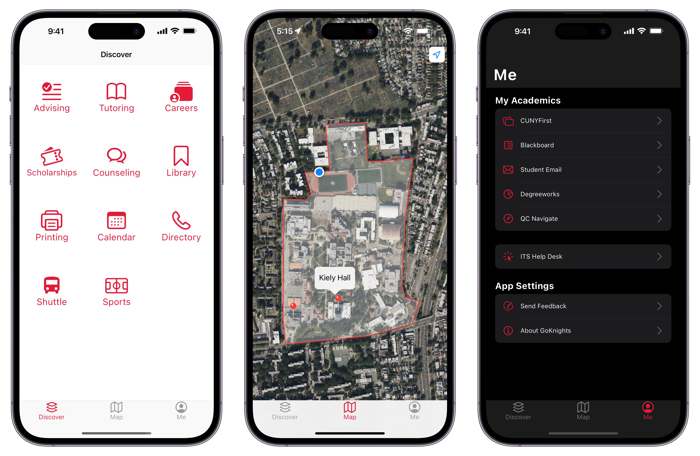

<a name="readme-top"></a>
[](https://wakatime.com/badge/github/popoway/goknights) 


<!-- PROJECT LOGO -->
<br />
<div align="center">
  <a href="https://github.com/popoway/goknights">
    
  </a>

  <h3 align="center">GoKnights</h3>

  <p align="center">
    Your Queens College Knights experience, elevated
    <br />
    <a href="#readme-toc"><strong>Explore the docs »</strong></a>
    <br />
    <br />
    <a href="https://play.google.com/store/apps/details?id=com.popoway.goknights" target="_blank">
      
    </a>
    <a href="https://apps.apple.com/us/app/goknights/id6463623285?platform=ipad" target="_blank">
      
    </a>
    <a href="https://testflight.apple.com/join/74kqoOhR" target="_blank">
      
    </a>
    <br />
    <a href="https://apps.apple.com/us/app/goknights/id6463623285?platform=ipad" target="_blank">View Demo</a>
    ·
    <a href="https://github.com/popoway/goknights/issues">Report Bug</a>
    ·
    <a href="https://github.com/popoway/goknights/issues">Request Feature</a>
  </p>
</div>

## Table of Contents
<a name="readme-toc"></a>
- [Description](#description)
- [Getting Started](#getting-started)
  - [Prerequisites](#prerequisites)
  - [Installation](#installation)
- [Roadmap](#roadmap)
- [Contributing](#contributing)
- [Privacy](#privacy)
- [License](#license)
- [Acknowledgements](#acknowledgements)
- [Disclaimer](#disclaimer)

## Description

Inspired by numerous inquiries and questions from incoming freshmen during new student orientation this summer, this app is created in order to serve as a centralized destination to showcase some of the highlighted student services and resources available on campus.



This project is currently under development and will be updated periodically.

<p align="right">(<a href="#readme-top">back to top</a>)</p>

## Getting Started

Below are some brief instructions on setting up this project locally. To get a local copy up and running follow these simple example steps.

### Prerequisites

* [Flutter SDK](https://flutter.dev/docs/get-started/install) for cross-platform development
* [Xcode](https://developer.apple.com/xcode/) and [CocoaPods](https://cocoapods.org/) for iOS dependencies
* [Android Studio](https://developer.android.com/studio) for Android dependencies
* [Azure OpenAI Service API](https://azure.microsoft.com/en-us/products/ai-services/openai-service) or Commercial [OpenAI API](https://platform.openai.com/) for ChatKnights dependencies
* Your preferred code editor (I use [Visual Studio Code](https://code.visualstudio.com/))

### Installation

1. Clone the repo
   ```sh
   git clone https://github.com/popoway/goknights.git
   ```
2. Install dependency packages
   ```sh
   flutter pub get
   ```
3. Enter your API keys in `.env`:
   ```
   # example .env file
   GOOGLE_MAPS_API_KEY=your_key_here
   UPLOAD_KEYSTORE_PASSWORD=google_play_keystore
   OPENAI_API_ENDPOINT=your_endpoint (ex. api.openai.com)
   OPENAI_API_KEY=your_api_key
   OPENAI_API_MODEL=gpt-4-turbo
   ```
4. You're all set! Run the app with `flutter run` or your preferred editor.

To generate a _release_ build for iOS without codesign, run the following command:
```
flutter build ios --release --no-codesign
```

To build an Android app bundle for submission, run the following command:
```
flutter build appbundle
```

<p align="right">(<a href="#readme-top">back to top</a>)</p>

## Roadmap

- [x] Faculty timesheet
- [ ] i18n support with Italian, Chinese and Spanish
- [ ] https://pub.dev/packages/app_links

## Contributing

Contributions are what make the open source community such an amazing place to learn, inspire, and create. Any contributions you make are **greatly appreciated**.

If you found a bug or have a suggestion that would make this better, please fork the repo and create a pull request. You can also simply open an issue with the tag "enhancement".  
Don't forget to give the project a star! Thanks again!

1. Fork the Project
2. Create your Feature Branch (`git checkout -b feature/AmazingFeature`)
3. Commit your Changes (`git commit -m 'Add some AmazingFeature'`)
4. Push to the Branch (`git push origin feature/AmazingFeature`)
5. Open a Pull Request

Feel free to [open an issue](https://github.com/popoway/goknights/issues/new) for bug reports, and your suggestions on how this app can be improved.

Pull requests: If this is your first Flutter/Dart project, below are a few resources to get you started:

- [Lab: Write your first Flutter app](https://docs.flutter.dev/get-started/codelab)
- [Cookbook: Useful Flutter samples](https://docs.flutter.dev/cookbook)

For help getting started with Flutter development, view the
[online documentation](https://docs.flutter.dev/), which offers tutorials, samples, guidance on mobile development, and a full API reference.

To assist with translations, please review the [Localization Guide](https://github.com/popoway/goknights/wiki/Translations).

To report a security vulnerability, please review the [Security Policy](https://github.com/popoway/goknights/blob/main/SECURITY.md).

<p align="right">(<a href="#readme-top">back to top</a>)</p>

## Privacy

This app does not use cookies or similar technology to deliver its services and to analyze traffic. The app author respects your privacy. Please review the [Privacy Policy](https://github.com/popoway/goknights/blob/main/PRIVACY.md) for more information on how your data is handled.

<p align="right">(<a href="#readme-top">back to top</a>)</p>

## License

[GNU General Public License v3.0](https://github.com/popoway/goknights/blob/main/LICENSE)

Permissions of this strong copyleft license are conditioned on making available complete source code of licensed works and modifications, which include larger works using a licensed work, under the same license. Copyright and license notices must be preserved. Contributors provide an express grant of patent rights.

Open Source Licenses and Acknowledgements are available within the "About" dialog of the app.

<p align="right">(<a href="#readme-top">back to top</a>)</p>

## Acknowledgements

<table style="width: 100%;">
    <tbody>
        <tr>
            <td>Programming</td>
            <td rowspan=4>Ming Lei</td>
        </tr>
        <tr>
            <td>Graphics</td>
        </tr>
        <tr>
            <td>Translation: Chinese</td>
        </tr>
        <tr>
            <td>Translation: Spanish</td>
        </tr>
        <tr>
            <td>Translation: Hebrew</td>
            <td>Sofia Taherkhani</td>
        </tr>
        <tr>
            <td style="vertical-align: top;" rowspan=9>Beta Testers</td>
            <td>Allan Edmond</td>
        </tr>
        <tr>
            <td>Arina Logosh</td>
        </tr>
        <tr>
            <td>Brian Flores</td>
        </tr>
        <tr>
            <td>Callie Podias</td>
        </tr>
        <tr>
            <td>Chris Galarraga</td>
        </tr>
        <tr>
            <td>Daniel Yakubov</td>
        </tr>
        <tr>
            <td>Erika Guadalupe</td>
        </tr>
        <tr>
            <td>Riyahauna Headley</td>
        </tr>
        <tr>
            <td>Sayashmini Madhow</td>
        </tr>
    </tbody>
</table>

Special thanks to the following departments at Queens College for their support and guidance: 

- [Office of Associate Provost for Innovation and Student Success](https://www.qc.cuny.edu/student-success/)
- [International Students and Scholars Office](https://www.qc.cuny.edu/academics/iss/)
- [Office of Student Affairs and Enrollment Management](https://www.qc.cuny.edu/student-affairs-enrollment-management/) 

<p align="right">(<a href="#readme-top">back to top</a>)</p>

## Disclaimer

"Disclaimer: While I am both an employee of Queens College and a graduate student in Computer Science here, the "GoKnights" app is a personal project developed during my summer break. The content, views, and opinions expressed within the app are solely my own and do not reflect the positions, strategies, or opinions of Queens College. This app is neither officially associated with nor maintained by Queens College as part of my employment."

<p align="right">(<a href="#readme-top">back to top</a>)</p>
